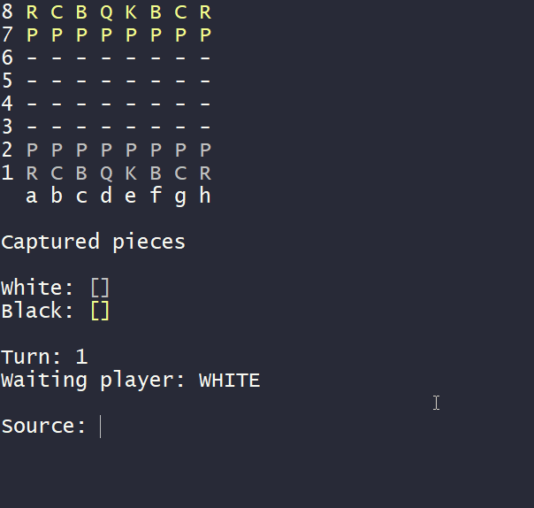

# :clipboard: Projeto - Chess Game Java
O objetivo deste projeto é construir um sistema que simula o jogo de xadrez, com o intuito de aplicar os principais fundamentos  estudados a respeito da Programação Orientada a Objetos e a
linguagem de programação Java.


## :bookmark_tabs: Requisitos

Para executar a aplicação Java é necessário:

* Possuir uma distribuição Java ```JDK``` ou ```JRE``` instalado na sua máquina.
  * Exemplo de distribuições: [Amazon Corretto](https://aws.amazon.com/pt/corretto/?filtered-posts.sort-by=item.additionalFields.createdDate&filtered-posts.sort-order=desc) / [Azul Zulu](https://www.azul.com/downloads/?package=jdk#download-openjdk).
* Importar o projeto para uma IDE, por exemplo [Eclipse](https://www.eclipse.org/downloads/packages/release/2021-12/r/eclipse-ide-enterprise-java-and-web-developers).
  * A IDE gera os arquivos compilados automaticamente, no caso do eclipse, a pasta ``bin/``
  * Dessa forma, em um terminal dentro do diretório ``bin/``, execute:  ```java application/Program```
  * Obs: Para que o tabuleiro e as peças apareçam coloridos é necessário utilizar um terminal compatível, como o [Git Bash.](https://git-scm.com/downloads)
* Ou simplesmente execute o arquivo executável ``.jar`` do projeto.
  * Em um terminal, preferencialmente colorido, execute: ``java -jar chessGame.jar``
  
## :movie_camera: Demonstração

|  |
| :--------------------------------: |

## :mag: Tópicos abordados

* Classes e Objetos
* Encapsulamento
* Construtores
* ToString (Object e anotação overriding)
* Associações
* Modificadores de acesso
* Estrutura de dados matriz
* Enumerações
* Herança
* Downcasting
* Membros estáticos
* Padrão de Camadas - Layers  Pattern
* Exceções - Exceptions
* Overriding
* Polimorfismo (ToString)
* Construtor com tratamento de exceção (Programação defensiva)
* Classes e Métodos abstratos
* Sobrecarga - overloading
* Estrutura de dados Lista

## :paperclip: Referências

* [Udemy - Java Completo com Prof. Nélio Alves](https://www.udemy.com/course/java-curso-completo/)

* [Encapsulamento - Padrão JavaBeans](https://en.wikipedia.org/wiki/JavaBeans)

* [Modificadores de Acesso](https://docs.oracle.com/javase/tutorial/java/javaOO/accesscontrol.html)
  * [Discussão no Stack Overflow sobre modificadores de acesso]()

* Manipulando Data e Hora com Java
  * [Classe Date](https://docs.oracle.com/javase/10/docs/api/java/util/Date.html)
  * [Classe SimpleDateFormat](https://docs.oracle.com/javase/10/docs/api/java/text/SimpleDateFormat.html)

* [Enumerações](https://docs.oracle.com/javase/tutorial/java/javaOO/enum.html)

* [Hierarquia de Exceções Java](https://docs.oracle.com/javase/10/docs/api/java/lang/package-tree.html)
